HSM Guide
=========

An introduction to HSMs.


## Authors

- Chris Snow
- Colin Cook
- Nick Bitounis
- Juris Lacis
- Other contributors ...

## Book License

CC0 1.0 Universal

# Preface

## About this book

A primary role of a HSM is the secure management of digital keys. This book introduces digital key
management concepts and reinforces those concepts with exercises that the reader can perform on an open
source Thales HSM Simulator.

The reader should have a basic understanding of symmetric and asymmetric cryptography. Appendix A,
Introductory Books in Cryptography provides a list of introductory books in cryptography for those
wishing to learn the basics or just wanting to refresh their knowledge in the field of cryptography.

This book is developed by the community - please send me your contributions.

 - The source of this book is available [here](https://github.com/snowch/hsm-guide/blob/master/book.md)
 - You can view the print version of the book [here](https://gitprint.com/snowch/hsm-guide/blob/master/book.md)

## Audience

Undergraduate and graduate students should find that this book supplements their studies in the theoretical
concepts of cryptography with practical applications.

Software Engineers and Architects designing and building security solutions using the Thales brand of
HSM will learn concepts and patterns of key management that can be applied to their designs

## Book Organisation

Chapter 1, Introduction describes the role fulfilled by a HSM. The Thales series of HSM's are then
introduced with a short history of their evolution. Finally, an open source Thales Simulator project is
presented, with hands on exercises for the reader to install the Simulator and then connect to it from Java,
C#, and ruby clients.

Chapter 2, Theory covers the cryptography basics, different types of cryptographic functions and algorithms. 
That chapter includes the basic information of encryption and message authentication functions used in cryptography.
TODO finish about Chapter 2

Chapter 3, HSM Local Master Keys (LMKs) covers in detail the concept of the LMKs. The knowledge
gained in this chapter is fundamental to your understanding of the Thales HSM. Almost all other chapters
depend on you understanding the material covered in this chapter. This chapter concludes with exercise
with the Thales Simulator to help instill the concepts of LMKs.

Chapter 4, Key Concepts describes general key concepts that you need to know in addition to the material
covered in the previous chapter about LMKs. The knowledge in this chapter is of vital importance when
interacting with the Thales HSM. Exercises are provided with the Thales Simulator to put the concepts
learnt in this chapter into practise.

Chapter 5, Secure Key Exchange two sites that are secured with HSMs need to have a set of keys that are
shared between the HSMs. This chapter describes how keys are created and shared. Exercises are given
to setup two demo sites with the Thales Simulator and generate and share keys between the demo sites.

Chapter 6, Dynamic Key Exchange 

TODO describe other chapters

# Introduction

## Overview

A primary role of a HSM is the secure management of digital keys. This document describes digital key
management concepts, and also describes some key management patterns for solving specific problems.

Other acronyms for Hardware Security Modules include:

- *HSM* :  Hardware Security Module / Host Security Module
- *TRSM* :  Tamper Resistant Security Module
- *SCD* :  Secure Cryptographic Devices

TODO: Why digital key management? Life without a HSM?
TODO: Thales Simulator project overview.

## Thales HSM History and Versions

TODO provide a brief history of THales HSMs and an overview of current HSM versions.

## Thales HSM interaction

There are two usage patterns for interacting with the HSM:

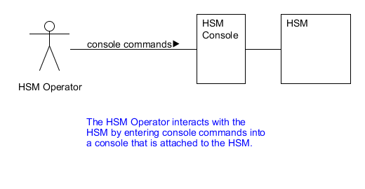
 
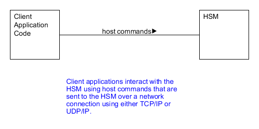

### Console Commands

Console commands fall into the categories:

- HSM diagnostics
- Creating Keys
- TODO what else?

### Host Commands

Host commands fall into the categories:

- TODO

# Theory

TODO introduction to this section

## Bits, Bytes and Hex

TODO write some information on bits, bytes and hex representation of data

## Cryptographic functions

Cryptographic functions fall into two main classes called *encryption* and *message authentication functions*. 

Encryption functions are used to transmit data securely. Encryption functions are two way functions and have both encryption and decryption algorithms. The sender encrypts the message to be sent with the encryption algorithm and the cryptographic key. After receiving the encrypted data the recipient uses a decryption algorithm and cryptographic key to decrypt the encrypted data received:

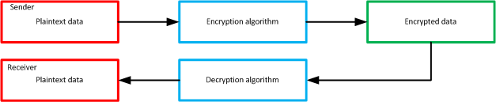

Authentication functions are used to ensure that the message was not modified during transmission. The message authentication function result is not reversable. The sender calculates a check sum of the message and sends it together with plaintext or encrypted message. The sender, using the same message authentication algorithm can verify the check summ received together with the message. If the check sum is valid, the receiver can be sure that the message was not modified during transmission:


### Encryption functions

Encryption functions are divided into two classes, *symmetric* and *asymmetric*. 

Symmetic encryption algorithms uses the same key for both encryption of plaintext data and decryption of ciphertext. Usually, the decryption algorithm is completely reversed encryption algorithm. The symmetric encryption can use stream ciphers or block ciphers. **This document covers only block cipher encryption**. Block cipher algorithms operate with fixed length blocks of bits on input, if the plain text message can not be split into blocks of the required length before encryption, it has to be padded with additional bytes to meet the required length. 

Some of the most commonly used symmetric algorithms are: 
- Data Encryption Standard (DES / 3DES)
- Advanced Encryption Standard (AES)
- Blowfish
- Twofish

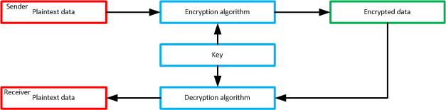

Asymmetric, also known as public-key algorithms use different keys (key pairs) for data encryption and decryption, these are called the private key and public key. Both the private and public keys are mathematicaly linked. The asymmetric encryption and decryption algorithms are also different. Before communication the receiver generates the pair of keys and keeps private key secret. The public key is distributed with other parties involved in data exchange. The public key used to encrypt data can't be used to decrypt it. Data can only be decrypted with the private key.

Some of the most commonly used asymmetric algorithms are:
- Rivest Shamir Adleman (RSA)
- Diffie-Hellman
- Digital Signature Algorithm (DSA)
- ElGamal
- Elyptic Curve Cipher (ECC)

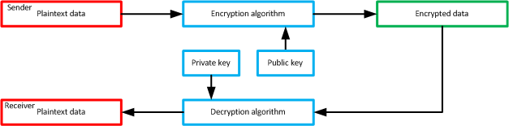

TODO - brief paragraph to say when to use symmetric and when to use assymetric?

### Message authentication functions

Authentication functions are divided into 2 classes, *hash* and *MAC*.

Hash functions are message authentication functions wich produce a fixed length output sum (hash) of variable length input data. The hash functions do not use the encryption functions to produce hashes. Usually in cryptography, hash functions are applied on plain text messages before encryption, so that secrets are not used to produce a hash of the message. Atacker can generate the hashes free for modified messages, because of that no reason to use hash functions on encrypted messages or on plaintext messages without encryption of them.

Some of the most commonly used hash functions:
- MD5
- SHA-1
- SHA-2

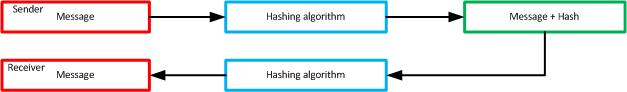

MAC functions also called keyed hash functions are cryptographic based message authentication functions to produce the short output check sum over the message used to ensure, that the message was not modified during transmission. In contrast to hash functions, MACs are generated using cryptographic algorithms and secret keys. The MAC can be securely applied to plain text messages without message encryption because it uses cryptographic keys to produce MAC.

The most commonly used MAC algorithms are defined in ISO-9797 standard.

TODO - can we list some of the algorithms?


TODO - brief paragraph to say when to use hash and when to use mac?

## Padding

TODO - Introduction to paddings

### Symmetric block cipher paddings

In a case of symmetric block ciphers, padding is used to complete the message till the full block length. For example, if the message to be encrypted with DES algorithm has only 31 byte of data, it must be filled with additional 1 byte to be 32 bytes long, since DES algorithm needs 8 bytes of input plaintext data. 

#### PKCS#5 padding

PKCS#5 padding is the most common type of padding applied to message during encryption. The padding must be removed from message after decryption to restore the original message content. PKCS#5 padding fills message with bytes with padding length as value. If message meets length requirements, additional full block of padding must be added to the end of message.

The example of PKCS#5 padding for incomplete message:


The example of PKCS#5 padding for complete 8 byte message:


The example of PKCS#5 padding on Java:

```java
/* 
 * since different symmetric algoritms have different input data block sizes
 * the blockSize variable is passed to the methods
 */

public static byte[] pkcs5Pad(byte[] block, int bloclSize) {
	int padLen = blockSize - block.length % blockSize;
	if (padLen == 0) {
		padLen = blockSize;
	}
	int padVal = (byte)padLen;
	byte[] paddedBlock = new byte[block.length + padLen];
	System.arraycopy(block, 0, paddedBlock, 0, block.length);
	for (int k = 0; k < padLen; k++) {
		paddedBlock[(block.length + k)] = (byte)padVal;
	}
	return paddedBlock;
}

public static byte[] pkcs5Unpad(byte[] paddedBlock) {
	int padLen = paddedBlock[(paddedBlock.length - 1)];
	int plainLen = paddedBlock.length - padLen;
	byte[] plainBlock = new byte[plainLen];
	System.arraycopy(paddedBlock, 0, plainBlock, 0, plainLen);
	return plainBLock;
} 
```

#### ISO-9797 Method 1 padding

ISO-9797 Method One padding is used for message MACing. This method adds zero bytes to the end of message until it meets the length requirements. It is not necessery to add an additional block of padding if a message meets length requirements. Method One padding can not be used for message encryption because it is impossible to differentiate padding bytes from the message content. 


The example of ISO-9797 Method 1 padding on Java:

```java
/* 
 * since different symmetric algoritms have different input data block sizes
 * the blockSize variable is passed to the methods
 */
 
public static byte[] iso9797Method1Pad (byte[] block, int blockSize) {
	int padLen = blockSize - block.length % blockSize;
	if (padLen == blockSize) {
		padLen = 0;
	}
	byte[] paddedBlock = new byte[block.length + padLen];
	System.arraycopy(block, 0, paddedBlock, 0, block.length);
	return paddedBlock;
}
```

#### ISO-9797 Method 2 padding

ISO-9797 Method Two padding is used for message padding for MAC calculation, but it can be used, also, for message encryption. The padding applied to the message adds one byte vith value 0x80 (a singe bit with value 1) and, if necessery, adds zero bytes until the message meets length requirements. If that padding method is used for message MACing, it is not necessery to add additional block of padding if message is complete, but in a case of message encryption it must be.

Example of ISO9797 Method 2 padding for incomplete message


Example of ISO9797 Method 2 padding for complete message


The example of ISO-9797 Method 2 padding on Java:

```java
/* 
 * since different symmetric algoritms have different input data block sizes
 * the blockSize variable is passed to the methods
 */
 
public static byte[] iso9797Method2Pad (byte[] block, int blockSize, boolean forMacing) {
	int padLen = blockSize - block.length % blockSize;
	// if padding is used for MACing, we do not need to add additional block
	// in a case of complete message length (multiple of blockSize)
	if (forMacing && padLen == blockSize) {	
		padLen = 0;
	}
	byte[] paddedBlock = new byte[block.length + padLen];
	System.arraycopy(block, 0, paddedBlock, 0, block.length);
	paddedBlock[block.length] = (byte)0x80;
	return paddedBlock;
}

public static byte[] iso9797Method2Unpad (byte[] paddedMsg) {
	int padIdx = 0;
	for (int i = paddedMsg.length - 1; i > 0; i--) {
		if (paddedMsg[i] == (byte)0x80) {
			padIdx = i;
		}
	}
	byte[] message = new byte[paddedMsg.length - padIdx];
	System.arraycopy(paddedMsg, 0, message, 0, message.length);
	return message;
}
```

### Asymmetric cipher paddings

In the most cases asymmetric cipher paddings are used to randomise the output. Usualy, asymmetric paddings have fixed length and is placed in plaintext message in the predefined position.

#### PKCS#1 v1.5 padding

PKCS#1 v1.5 padding is used to randomise the ciphertext output dirung RSA encryption to avoid some types of attacks. The message length to be encrypted using RSA-PKCS#1 scheme must meet the condition ```mLen <= k - 11```, where ```mLen``` is plaintext message length and ```k``` is the public key length. The padding must be at least 11 bytes long and contain at least 8 non-zero random bytes. The scheme below shows the padding structure:

TODO - fix missing image 

When the ciphertext is decrypted, the padding structure must be validated. In a case of structure mismatch the error should be returned. The conditions of valid padding are:

- 1st byte must be 0x00;
- 2nd byte must be 0x02;
- Encrypted message must have a byte with value 0x00 separating random byte octet from message;
- Random byte octet must be at least 8 non-zero bytes long.

The example of PKCS#1 v1.5 padding on Java:

```java
/*
 * The example below adds PKCS#1 padding of length to make message the same 
 * size as pubic key.
 */
 
public static byte[] pkcs1Pad (byte[] message, int keyLen) {
	java.util.Random r = new java.util.Random();
	int padLen = keyLen - message.length - 3;
	byte[] rand = new byte[padLen];
	byte[] paddedMsg = new byte[message.length + padLen + 3];
	paddedMsg[0] = (byte)0x00;
	paddedMsg[1] = (byte)0x02;
	paddedMsg[padLen + 2] = (byte)0x00;
	int n = 0;
	for (int i = 0; i < padLen; i++) {
		n = r.nextInt(256);
		if (n == 0) {
			i--;
			continue;
		}
		rand[i] = (byte)n;
	}
	System.arraycopy(rand, 0, paddedMsg, 2, rand.length);
	System.arraycopy(message, 0, paddedMsg, padLen + 3, message.length);
	return paddedMsg;
}

public static byte[] pkcs1Unpad (byte[] paddedMsg) 
		throws javax.crypto.BadPaddingException {
	int sepIdx = new String(paddedMsg).indexOf("\0", 1);
	if (paddedMsg[0] != (byte)0x00 || 
			paddedMsg[1] != (byte)0x02 || 
			sepIdx == -1 || 
			sepIdx < 10) {
		throw new javax.crypto.BadPaddingException("Padding does not meet required conditions");
	}
	byte[] message = new byte[paddedMsg.length - sepIdx - 1];
	System.arraycopy(paddedMsg, sepIdx + 1, message, 0, message.length);
	return message;
}
```

#### PKCS#1 OAEP padding

PKCS#1 OAEP (Optimal Asymmetric Encryption Padding) padding is used to randomise the ciphertext output dirung RSA encryption to avoid some types of attacks. The message length to be encrypted using RSA-OAEP scheme must meet the condition ```mLen <= k - 2hLen - 2```, where ```mLen``` is plaintext message length, ```k``` is a public key length, ```hLen``` is the length of hash function output. 

TODO - to finish.

## Exercises

### Asymmetric cipher paddings
1) To verify the PKCS#1 v1.5 padding the following Java code can be used:

```java
import java.security.KeyPair;
import java.security.KeyPairGenerator;
import java.security.PrivateKey;
import java.security.PublicKey;
import javax.crypto.Cipher;

public class RSAPaddingTest {
	
	private static String byte2hex(byte bs[]) {
		// refer to Appendix A for that method code
	}
	
	/*
	 * Method generates the private and public RSA key pair
	 */

	private static KeyPair generateKeyPair (int keyLen) throws Exception {
		KeyPairGenerator kpg = KeyPairGenerator.getInstance("RSA");
		kpg.initialize(keyLen);
		KeyPair kp = kpg.genKeyPair();
		return kp;
	}
	
	/*
	 * Method encrypts passed message with RSA public key applying 
	 * PKCS1Padding to plaintext message
	 */
	
	private static byte[] encrypt (String msg, PublicKey publicKey) throws Exception {
		Cipher cipher = Cipher.getInstance("RSA/ECB/PKCS1Padding");
		cipher.init(Cipher.ENCRYPT_MODE, publicKey);
		byte[] ciphMsg = cipher.doFinal(msg.getBytes());
		return ciphMsg;
	}
	
	/*
	 * Method decrypts passed cipher text with RSA private key and do not remove
	 * padding from plaintext message
	 */
	
	private static byte[] decrypt (byte[] ciphMsg, PrivateKey privateKey) throws Exception {
		Cipher cipher = Cipher.getInstance("RSA/ECB/NoPadding");
		cipher.init(Cipher.DECRYPT_MODE, privateKey);
		byte[] plainMsg = cipher.doFinal(ciphMsg);
		return plainMsg;
	}
	
	public static void main (String[] args) {
		String msg = args[0];
		int keyLen = Integer.parseInt(args[1]);
		try {
			KeyPair kp = generateKeyPair(keyLen);
			PublicKey publicKey = kp.getPublic();
			PrivateKey privateKey = kp.getPrivate();
			byte[] ciphMsg = encrypt(msg, publicKey);
			byte[] plainMsg = decrypt(ciphMsg, privateKey);
			System.out.println(byte2hex(plainMsg));
		} catch (Exception e) {
			e.printStackTrace();
		}
	}
}
```

The code above can be compiled with command:

```javac RSAPaddingTest.java```

Run with command:

```java RSAPaddingTest <message> <key length>```

The output will be as follows:

```
$ java JavaRSA 34234234234 512
0002570D03777D36E4B335597EFCDB68FA076D6B7DFD210B727C9A088D351D52846185F9C03826B35062C1EFB3644C190BE6DDC2003334323334323334323334
```

The output abowe shows, that Java adds a random byte PKCS#1 padding to message making it the same length as a public key. In the example public key (modulo) is 512 bits long.

- ```00``` - 1st byte is ```0x00```
- ```02``` - 2nd byte is ```0x02```
- ```570D03777D36E4B335597EFCDB68FA076D6B7DFD210B727C9A088D351D52846185F9C03826B35062C1EFB3644C190BE6DDC2``` - random bytes (50)
- ```00``` - padding separator, ```0x00```;
- ```3334323334323334323334``` - plaintext message

# Introduction to the Thales Simulator

## Thales Simulator Exercises

This section provides some exercises to get hands on experience using the Thales Simulator.

### Setting up the Thales Simulator

In this exercise, you will download, install and run the Thales Simulator on a Windows machine.  The purpose of this exercise is to get the Thales Simulator setup and ready for use in later chapters.

#### Download and Install the Thales Simulator

 1. Download ```ThalesSim.Setup.0.9.6.x86.zip``` from: [http://thalessim.codeplex.com/releases/view/88576](http://thalessim.codeplex.com/releases/view/88576)
 2. Unzip the downloaded file and execute the file ```ThalesWinSimulatorSetup.msi```, accepting the default options.
 
#### Starting the Thales Simulator

 1. Navigate to the folder where you installed the Simulator (E.g. ```C:\Program Files (x86)\NTG\Thales Simulator\```)
 2. Execute ThalesWinSimulator.exe (if your are running Windows 7, right click the file and select Run As Administrator)
 3. Click the Start Simulator button: 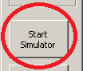
 4. In the Application Events window, the simulator will inform you that it could not find a file containing the LMK keys so it will create a new set of keys for you. The Simulator will always create the same keys. 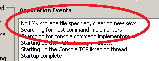


#### Using the Simulator Console

In this section, we will connect to the HSM Console and run a basic command, Query Host (QH) to test connectivity to the HSM.

For a full list of console commands, you will need to refer to the *Console Reference Manual* which is available from Thales.

Note: The Thales Simulator only implements a subset of the commands. A list of implemented console commands can be found  [here](http://thalessim.codeplex.com/wikipage?title=list%20of%20supported%20console%20commands).

#####  Connecting with the Simulator Console

In this section, we ... TODO describe what we are doing here

 1. Start the simulator as described in [Starting the Thales Simulator](./book.md#starting-the-thales-simulator)
 2. Click The Console button 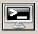
 3. In the console window click *Connect to Console*.
 4. Enter the *console* command ```QH``` followed by ENTER. 
 5. You should see something similar to this 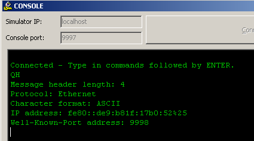
 
In this exercise, we executed a console command ```QH``` against the simulator and observed the response that was displayed by the simulator.

#####  Connecting with a Python Client

See Appendix (TODO) to see instructions for:
- installing python
- running python code

```python
import binascii
import socket
import sys

# open a connection to the Thales Simulator
sock = socket.socket(socket.AF_INET, socket.SOCK_STREAM)
server_address = ('localhost', 9998)
sock.connect(server_address)

# the command we need to send
command = b'0006303030304e43'

# convert the hex string to binary
command = binascii.a2b_hex(command)

# send a command
sock.send(command)

# receive the command response
recv_data = sock.recv(1024)

# printout response
sys.stdout.buffer.write(recv_data)

# close the connection
sock.close()
```

The code simply opens a TCP connection to a Thales Simulator listening on ```localhost``` on port ```9998```.  Next the python client converts the string ```0006303030304e43``` from its hexidecimal format to binary and sends it to the Thales Simulator.  Finally the code receives the response and prints it to standard output.

To understand the meaning of the string ```0006303030304e43```, it can be broken down as follows (in reverse order):

- ```4e43``` is the 2 byte command ```NC``` as hex
- ```30303030``` adds a 4 byte header ```0000``` as hex
- ```0006``` represents the length in hex of the comamnd and header (i.e. the length of ```0000NC```)

The command should output a response similar to the following:

```
 !0000ND007B44AC1DDEE2A94B0007-E000
```

The response from HSM can be broken down as follows:

- ```!``` actualy is ```0021```, it is software header returned by HSM, actual response length
- ```0000``` is HSM response header which is set the same as for received command
- ```ND``` the response code. The response from HSM always is command code with incremented second letter
- ```00``` error code, ```00``` means that no errors occured during command processing
- ```7B44AC1DDEE2A94B``` Local Master Key (see corresponding chapter) check value
- ```0007-E000``` means the HSM firmware revision number

Each command has its own response specification, see "Host command reference manual" for more details.

# HSM Local Master Keys (LMKs)

Local Master Keys (LMKs) are a central concept for HSMs. This section describes LMKs in more detail.

## LMK Overview

Local Master Keys are a sets of 40 DES keys. They are stored securely in the HSM making it very difficult for an attacker to gain access to them. LMKs are the only keys that are stored in the HSM.

LMKs are not used for encrypting data, but are instead used to encrypt and decrypt other keys as these
enter or leave the HSM. LMKs are used to ensure that even if the data traffic between the HSM and an
application is recorded, the clear values of any exchanged keys are not compromised.

LMKs come in pairs and the Thales HSM contains several LMK pairs. Different LMK pairs are used to
encrypt/decrypt different types of security keys. LMK pairs are identified by two numbers, for example
LMK pair 04-05, LMK pair 14-15, etc. See the diagram below.

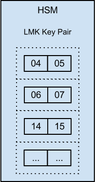

Each LMK pair is assigned a code. LMK pair 04-05 is assigned code 00, while LMK pair 14-15 is assigned
code 02. The full list of HSM key pairs are listed in Table 2.1, “LMK Key Pairs”, below. Note that HSM
key pairs do not start at 00-01, instead the numbering starts at 04-05, and runs non-contiguously to 38-39.

| Key Pair  | Code  |
|-----------|-------|
| 04-05     | 00    |
| 06-07     | 01    |
| 14-15     | 02    |
| 16-17     | 03    |
| 18-19     | 04    |
| 20-21     | 05    |
| 22-23     | 06    |
| 24-25     | 07    |
| 26-27     | 08    |
| 28-26     | 09    |
| 30-31     | 10    |
| 32-33     | 11    |
| 34-35     | 12    |
| 36-37     | 13    |
| 38-39     | 14    |

Each HSM has a unique set of LMK pairs that can be either randomly generated or loaded from smart cards. HSM users jealously guard the LMKs because the integrity of the key management security scheme depends upon them.

## LMK Variants

Back when the HSM had only a handful of LMK pairs, more than the type of keys that had to be encrypted, a way had to be found to ensure that different key types can be used but also provide a way to identify parity errors with these key types. Variants are an easy way to pseudo-multiply your LMK pairs. (TODO validate this)

Keys are encrypted under LMK pairs using either the clear value of the LMK or a variant of the LMK. An LMK variant is created by performing a XOR operation with a value on the LMK key. For example, variant 1 of an LMK is created by XORing the LMK with the value 000000000000000000000000000000A6. The Thales HSM supports 10 variants for each LMK pair, with variant 0 being the clear LMK itself. The full list of variant calculation functions can be seen in the Table below.

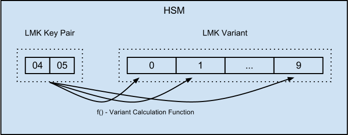

| Variant number | Variant Calculation Function - XOR LMK with: |
|---------|--------------------------------------------|
| 0       | Not applicable - use clear value of LMK    |
| 1       | 000000000000000000000000000000A6           |
| 2       | 0000000000000000000000000000005A           |
| 3       | 0000000000000000000000000000006A           |
| 4       | 000000000000000000000000000000DE           |
| 5       | 0000000000000000000000000000002B           |
| 6       | 00000000000000000000000000000050           |
| 7       | 00000000000000000000000000000074           |
| 8       | 0000000000000000000000000000009C           |
| 9       | 000000000000000000000000000000FA           |

## Exercises

TODO - what exercises could be performed on the Simulator around LMK Concepts?  Could we walk through the default keys with the HSM simulator and how to change those keys?

# Key Concepts

## Key Types

Each different key supported by the Thales HSM has a unique code called the key type code. The key type is a three-digit number and is made up from the code of the LMK pair and the LMK variant. Therefore, keys encrypted under LMK pair 04-05 using a variant 1 will have a key type equal to “00” + “1” = 001. It is important to understand key types since several Thales commands expect key type codes as parameters. The full list of key types can be seen in the table below.

| LMK Key Pair | LMK Code | Variant | Key Type Code | Key Type      |
|--------------|----------|---------|---------------|---------------|
| 04-05        | 00       | 0       | 000           | ZMK           |
| 06-07        | 01       | 0       | 001           | ZPK           |
| 14-15        | 02       | 0       | 002           | PVK, TMK, TPK |
| 14-15        | 02       | 4       | 402           | CVK, CSCK     |
| 16-17        | 03       | 0       | 003           | TAK           |
| 22-23        | 06       | 0       | 006           | WWK           |
| 26-27        | 08       | 0       | 008           | ZAK           |
| 28-29        | 09       | 0       | 009           | BDK1          |
| 28-29        | 09       | 1       | 109           | MK-AC         |
| 28-29        | 09       | 2       | 209           | MK-SMI        |
| 28-29        | 09       | 3       | 309           | MK-SMC        |
| 28-29        | 09       | 4       | 409           | MK-DAC        |
| 28-29        | 09       | 5       | 509           | MK-DN         |
| 28-29        | 09       | 6       | 609           | BDK2          |
| 28-29        | 09       | 7       | 709           | MK-CVC3       |
| 28-29        | 09       | 8       | 809           | BDK3          |
| 30-31        | 0A       | 0       | 00A           | ZEK           |
| 32-33        | 0B       | 0       | 00B           | DEK           |
| 32-33        | 0B       | 3       | 30B           | TEK           |

In the latest payShield9000 and HSM8000 firmwares Thales has introduced second, PCI-HSM standard compliant, key type table with the changes around 002 key type - PVK, TMK, TPK. The changes moves TMK and TPK to different LMK pair and Variants leaving PVK the only key of 002 type:

| LMK Key Pair | LMK Code | Variant | Key Type Code | Key Type      |
|--------------|----------|---------|---------------|---------------|
| 14-15        | 02       | 0       | 002           | PVK           |
| 36-37        | 0D       | 7       | 70D           | TPK           |
| 36-37        | 0D       | 8       | 80D           | TMK           |

## Key Check Value

The check value of a key is derived by DES encrypting 16 zeroes (8 zero bytes) using that key. For example, the KCV for key 0123456789ABCDEF is D5D44FF720683D0D

The purpose of a KCV is to ensure that a key has been correctly transmitted between different parties and that they key is also configured correctly in systems. It is common practice to transmit the KCV of a key along with the key itself. Sometimes, the complete result of the DES encrypt operation is used, but typically only the first six digits are used (in the example, D5D44F).

## Key Formats

The Thales HSM uses two major formats when processing security keys. These are Variant and ANSI.

The variant concept is similar to the one used to form LMK variants: a key is XORed with a value to form the key variant. Double-length keys are XORed with the value:

```text
00000000000000A6 000000000000005A
```

and triple-length keys are XORed with the value:

```text
00000000000000A6 000000000000005A 000000000000006A
```

TODO: how does the variant concept differ to the LMK variant concept?

The ANSI format is much simpler: a key is used as-is without performing any additional operations on it.

## Key Scheme

Depending on their length and key format, keys are designated by a key scheme that helps to quickly identify the nature of a key. Key schemes are the following:

| Key Scheme | Description |
|------------|-------------|
| Z          | Single-length ANSI keys |
| U          | Double-length variant keys |
| T          | Triple-length variant keys |
| X          | Double-length ANSI keys |
| Y          | Triple-length ANSI keys| 

## Exercises

TODO - what exercises could be performed on the Simulator around LMK Concepts?

# Secure Key Exchange

## Overview

To securely exchange information between two users using the DES encryption scheme, it is vital to securely share a set of initial keys. This role is fulfilled by the Zone Master Keys. Unlike an LMK which does not leave the HSM, ZMKs are intended to be shared between sites to create secure Zones. The ZMK is distributed manually between the sites. The ZMK allow future (data encrypting) keys to be automatically shared between sites by encrypting those future keys with the ZMK. In that regard, they work very much like the LMKs with the important exception that they can be shared between users.

ZMKs have a key type code of 000 (they are encrypted under LMK pair 04-05 with a variant of 0).

TODO diagram

The transfer of the ZMK between sites is performed manually. The ZMK is shared in parts (components) so that no one person will see the key.

TODO diagram

The data encryption key is a Zone PIN Key (ZPK). The ZPK was historically used to encrypt PINs for transfer between sites (e.g. between Acquirer and Issuer).

For local storage (e.g. on the application server using the ZMK), the ZMK is encrypted under one of the LMK keys.

## Example - Secure Key Exchange

Two parties want to exchange a ZMK. One party generates a random ZMK using three clear components which are the following:

```text
2CBF0D8FA4E66ECE 6B239E25B9BAD934
B60825E3790D31CE 4A4AA74397461C13
29BFE3C1D0C1E50B CD7038A42CFB160B
```

TODO: describe what is meant by clear components

Each of these clear components are kept by a separate custodian that works for the first party and are delivered to different custodians of the second party. To create the complete ZMK, each custodian enters their component to the HSM which combines them to form the ZMK. Most typically, the clear components are simply XORed to form the ZMK. In the example, the ZMK value is:

```text
B308CBAD0D2ABA0B EC1901C20207D32C
```

When generating the ZMK, the first party also gives the KCV of the ZMK to the second party (for the example key the KCV is 6CE4CF). That way, the second party can verify the correct reception and data entry of the ZMK components.

TODO: See “Exercise – Creating a ZMK” for hands on experience creating a ZMK.

## Exercises

### Creating a Zone Master Key (ZMK)

In this exercise, we create a Zone Master Key (ZMK) using console commands.

The ZMK is distributed manually as components. To create the ZMK, we first create three ZMK components.

#### Generate the ZMK Components

Generate three ZMK components using the console command Generate Component (GC). Repeat the command three times as shown below:

TODO: describe the various command options and how to choose which option values to use.

```text
GC                         # User input
Key length [1,2,3]: 2      # User input
Key Type: 000              # User input
Key Scheme: U              # User input
Clear Component: 79CD 2380 9B4F C1C4 7F9E FB2A DF2A 674A
Encrypted Component: U 1BA5 185A FCF1 5A1B 274B E1E0 03B4 7C2A
Key check value: 7A5B C7
GC                         # User input
Key length [1,2,3]: 2      # User input
Key Type: 000              # User input
Key Scheme: U              # User input
Clear Component: 0157 B3DF 6116 3402 372C 54FD 62F2 1C91
Encrypted Component: U FCE4 7AF7 FFF8 9F40 2407 A35A F063 D3E1
Key check value: 1E79 CB
GC                         # User input
Key length [1,2,3]: 2      # User input
Key Type: 000              # User input
Key Scheme: U              # User input
Clear Component: 7AEA B5A4 1A9E 9B68 EF80 494C 0819 4ADA
Encrypted Component: U EE8D 4F9E C8B2 ADF4 9CD2 F0D2 7F5C 95C5
Key check value: 277A 5F
```

#### Generate the ZMK from the components

This step uses the FK command to generate the ZMK from the three ZMK components previously generated:

TODO: describe the various command options and how to choose which option values to use.

```text
FK                                      # User input
Key length [1,2,3]: 2                   # User input
Key Type: 000                           # User input
Key Scheme: U                           # User input
Component type [X,H,E,S]: E             # User input
Enter number of components (2-9): 3     # User input
Enter component #1: U 1BA5 185A FCF1 5A1B 274B E1E0 03B4 7C2A
Enter component #2: U FCE4 7AF7 FFF8 9F40 2407 A35A F063 D3E1
Enter component #3: U EE8D 4F9E C8B2 ADF4 9CD2 F0D2 7F5C 95C5
Encrypted key: U 104C 4216 A751 FEEE FF55 698B 26C5 7789
Key check value: BA0F C3
```

# Dynamic Key Exchange

## Overview

TODO: Why dynamic key exchange?

## Zone PIN Key (ZPK)

The Zone PIN Key (ZPK) is a data encrypting key. It is used to encrypt the data that is transmitted in a security zone. For transfer between sites, the ZPK is encrypted under the ZMK. When stored locally (e.g. on the application server), the ZPK is encrypted using one of the LMK Keys.

ZPKs have a key type code of 001 (encrypted under LMK pair 06-07 with a variant of 0).

TODO: See “Exercise – Creating a ZPK” for hands on experience creating a ZPK.

### Example - Dynamic Key Exchange

Assume that the ZMK presented in the previous example has been exchanged between two parties. One party, then, generates a random ZPK equal to:

```text
ADD3B5C7B576D3AE 38B90B7C0EB67A7C, KCV = CB59C0
```

The party then encrypts this ZPK under the ZMK to safely transmit this to the other party. The ZPK under the ZMK is:

```text
C9A62E96ADFB52A7 815BE8D7E730B24E, KCV = CB59C0
```

## Key Translation

In our previous example, the value C9A62E96ADFB52A7 815BE8D7E730B24E represents the randomly created ZPK encrypted under the previously created ZMK. But imagine that one of the parties that have exchanged this ZPK needs to transmit it to another party with which they share a different ZMK which we’ll call ZMK2 . To properly transmit the ZPK to the other zone that is secured with ZMK2, the ZPK has to be:

- Decrypted under ZMK.
- Encrypted under ZMK2.

This process is called key translation. Key translation does not happen with specific key types as the ZMK that was used in the previous example but is a more general process - for example it is possible to translate a key from encryption under the ZMK to encryption under an LMK.

Key translation always takes place within the HSM to avoid exposing the clear value of the key being translated.

## Translating a ZPK (between ZMK encryption and LMK encryption)

The HSM provides functionality to translate a ZPK between ZMK and LMK. This is used when a ZPK is received by Site B. In this case, Site A sends the ZPK encrypted with the ZMK to Site B. Site B translates the ZPK to LMK encryption.

The ZPK under LMK encryption is used for encrypting/decrypting the data sent between the sites.

TODO: insert diagram

### Exercises

#### Creating a Zone PIN Key (ZPK)

In this exercise, we create a Zone PIN Key (ZPK) using console commands.

When prompted for the ZMK, use the encrypted ZMK value from the section called “Creating a Zone Master Key (ZMK)”.

```text
KG
Key length [1,2,3]: 2
Key Type: 001
Key Scheme (LMK): U
Key Scheme (ZMK) [ENTER FOR NONE]: X
Enter encrypted ZMK [ENTER FOR NONE]: U 104C 4216 A751 FEEE FF55 698B 26C5 7789
Enter ZMK check value [ENTER TO SKIP CV TEST]:
Key under LMK: U 8586 51EC 83AF CA66 8175 804F 5B7D CD6B
Key encrypted for transmission: X BAA5 18AA D10D 28A2 D32A 5688 317F 44EB
Key check value: 6543 F4
```

# PIN block creation (clear PIN blocks)

# PIN block encryption and security zones. ZPKs and TPKs

# PIN translation

# MACing

# CVV/CVV2/iCVV

# Appendix A - Commonly used code in examples

```java
private static String byte2hex(byte bs[]) {
	int i;
	String s = new String();
	String hex_digits = "0123456789ABCDEF";
	byte c;
	if (bs == null || bs.length == 0) {
		return s;
	}
	for (i = 0; i < bs.length; ++i) {
		c = bs[i];
		s += hex_digits.charAt((c >> 4) & 0xf);
		s += hex_digits.charAt(c & 0xf);
	}
	return s;
}
```

# Appendix B - Some other usefull code peaces

# Appendix C - Introductory Books in Cryptography

# Appendix - Installing Python

Download and install the latest version of python from https://www.python.org/download/

# Appendix - Connecting to the HSM using different languages

#####  Connecting with a Perl Client

In this exercise, we execute a host command against the Thales Simulator.

If you have perl installed, you can run the ```NC``` (Perform diagnostics) host command against the HSM as follows:

```perl
#!/usr/bin/env perl
use IO::Socket::INET; 
my $sock = new IO::Socket::INET(PeerAddr=>"localhost:9998") or die; 
$sock->send(pack "H*","0006303030304e43"); 
$sock->recv($data, 1024); print $data;
```

The command should output a response similar to the following:

```
!0000ND007B44AC1DDEE2A94B0007-E000
```

The response from HSM can be broken down as follows:

- ```!``` actualy is ```0021```, it is software header returned by HSM, actual response length
- ```0000``` is HSM response header which is set the same as for received command
- ```ND``` the response code. The response from HSM always is command code with incremented second letter
- ```00``` error code, ```00``` means that no errors occured during command processing
- ```7B44AC1DDEE2A94B``` Local Master Key (see corresponding chapter) check value
- ```0007-E000``` means the HSM firmware revision number

Each command has its own response specification, see "Host command reference manual" for more details.

#####  Connecting with a Java Client

In this session, we connect to the HSM over TCP/IP using Java. When we connect using Java, we can send Host Commands to the HSM.

In the code example, below, we send the command Perform Diagnostics (NC), and print the response
to System.out.

For a full treatment of Host Programming the Thales HSM, refer to the Thales documentation “Host
Programmer’s Manual”. For a full list of Host Commands, refer to the Thales documentation “Host
Command Reference Manual”

```java
import java.io.BufferedOutputStream;
import java.io.InputStream;
import java.io.OutputStream;
import java.net.Socket;
import java.nio.ByteBuffer;
public class Main {

   public static void main(String[] args) throws Exception {

      Socket socket = new Socket("localhost", 9998);

      String command = "0006303030304e43";
      
      // the following line converts the hex command string to a byte array
      byte[] bytes = ByteBuffer.allocate(8).putLong(Long.parseLong(command, 16)).array();

      OutputStream out = socket.getOutputStream();
      BufferedOutputStream bufferedOut = new BufferedOutputStream(out, 1024);
      bufferedOut.write(bytes);
      bufferedOut.flush();

      InputStream in = socket.getInputStream();
      int result;
      while ((result = in.read()) != -1) {
         System.out.print((char)result);
      }
      socket.close();
   }
}
```
See the description from [Connecting with a perl client](/book.md#connecting-with-a-perl-client) for the format of the command: ```0006303030304e43```.

#####  Connecting with a Unix client

If you have netcat (nc) installed, you can run a command by using echo convert a hex string to binary and send it to the Thales simulator using netcat.

Here we send the Thales command ```NC``` which asks the Thales Simulator to Perform Diagnostics and return the result:

```
$ echo -ne '\x00\x06\x30\x30\x30\x30\x4e\x43' | nc localhost 9998
!0000ND007B44AC1DDEE2A94B0007-E000
```

See the description from [Connecting with a perl client](/book.md#connecting-with-a-perl-client) for the format of the command: ```0006303030304e43```.

#####  Connecting with a PL/SQL client

If you want to call HSM using PL/SQL you can use the UTL_TCP package as in example procedure below:

```sql
CREATE OR REPLACE PROCEDURE call_hsm IS 

	v_to_hsm VARCHAR2(255);
	n_length NUMBER(2);
	v_from_hsm VARCHAR2(255);
	rw_from_hsm RAW(100);
	c utl_tcp.connection;
	BEGIN
		c := utl_tcp.open_connection('192.168.229.1', '9998', NULL, NULL, NULL, NULL, NULL, NULL, 1); 
		v_to_hsm := '0000' || 'NC';
		v_to_hsm := CHR(0) || CHR(LENGTH(v_to_hsm)) || v_to_hsm;
		v_from_hsm := utl_tcp.write_text(c, v_to_hsm);
		n_length := utl_tcp.available(c, 1); 
		n_length := utl_tcp.read_raw(c, rw_from_hsm, 100);
		SELECT SUBSTR(CAST(rw_from_hsm AS VARCHAR2(255)), 5) 
			INTO v_from_hsm 
			FROM dual;
		v_from_hsm := utl_i18n.raw_to_char(v_from_hsm);
		dbms_output.put_line(v_from_hsm);
		utl_tcp.close_connection(c);
	END;
```
